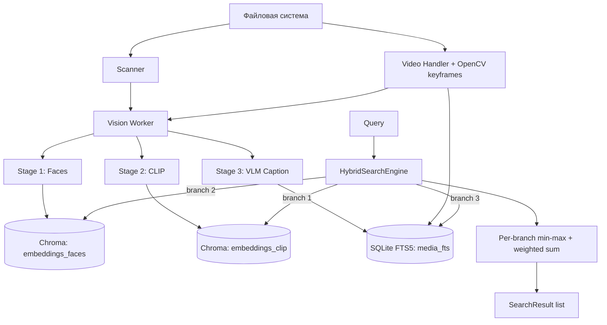

# Архитектура сервиса: Vision Semantic Archive (VSA)

> Документ синхронизирован с кодовой базой 2026-04-22 после правок v2
> (`docs/plans/2026-04-22-audit-v2-fixes.md`). Расхождения с реализацией,
> которые были отмечены в прошлом аудите (NLP parser, reranker формула,
> keyframe interval), устранены или явно переведены в future work.

## Роли агентов (System Prompts)

Вынесены в отдельные файлы:

- `docs/system-prompts/role-a-database-schema-architect.md`
- `docs/system-prompts/role-b-vision-cuda-performance-engineer.md`
- `docs/system-prompts/role-v-llm-vlm-orchestrator.md`
- `docs/system-prompts/role-g-search-ui-integrator.md`

## 1. Технологический стек и версии

- **Язык:** Python 3.11 или 3.12 (3.14 не поддерживается из-за текущей
  совместимости onnxruntime-gpu).
- **UI:** Streamlit 1.32+.
- **Vector DB:** ChromaDB 0.4.24+ (локальный `PersistentClient`).
- **Metadata/FTS:** SQLite FTS5 (из стандартной поставки).
- **DL Framework:** PyTorch 2.2+ (CUDA 12.1 на проде, CPU fallback в dev).

### Inference Engines

- **Faces:** InsightFace `buffalo_l` через `onnxruntime-gpu` (CUDA) или CPU.
- **Semantic (CLIP):** `open_clip_torch` с `hf-hub:openai/clip-vit-large-patch14`.
  Веса скачиваются самим `open_clip`; локальные safetensors больше не
  хранятся и не качаются (см. `docs/plans/2026-04-22-audit-v2-fixes.md`,
  §3.5).
- **VLM/LLM:** Ollama API (`moondream2` → описания кадра, `llama3` →
  агрегация видео-описаний). NLP-парсер запросов планируется в будущей
  итерации (future work, см. §7).

## 2. Компоненты системы

### Модуль A: Ingestion Pipeline (`core/indexer.py`)

- **Scanner:** рекурсивный обход директорий, SHA-256 хеш файла для дедупа
  и rebind путей.
- **Vision Worker:** CLIP-эмбеддинг кадра + InsightFace-эмбеддинги лиц.
  Все sync-вызовы выполняются через `asyncio.to_thread` чтобы не блокировать
  event-loop (BUG-N08).
- **VLM:** `OllamaClient` с ретраями, экспоненциальным backoff и единым
  долгоживущим `httpx.AsyncClient`.
- **Video Handler:** кэйфреймы через OpenCV (интервал + scene-delta). На
  уровне ingestion кадры выдаются батчем в CLIP и параллельно в Ollama; для
  стыковки используется `asyncio.gather(..., return_exceptions=True)` —
  отдельный сбой одного кадра больше не «роняет» всё видео (BUG-N09).

### Модуль B: Storage Layer (`core/db.py`)

#### ChromaDB Collections (`embeddings_clip`, `embeddings_faces`)

- `embeddings_clip`: `{id: media_id or frame_media_id, vector: clip_emb, metadata: {path, type, frame_media_id?, frame_index?, frame_timestamp_sec?}}`
- `embeddings_faces`: `{id: face_id, vector: face_emb, metadata: {path, parent_media_id, score, bbox, frame_* }}`

Схема коллекций не меняется без плана миграции (guardrail).

#### SQLite (`metadata.db`)

- `media(id, path UNIQUE, hash UNIQUE, caption, created_at, metadata_json)` с
  FTS5-зеркалом `media_fts` (триггеры INSERT/UPDATE/DELETE).
- `video_keyframes(frame_media_id, video_media_id, frame_index, timestamp_sec, frame_path, created_at)`.
- `schema_version(version)` — служит плейсхолдером для будущих миграций.
- Pragmas: `journal_mode=WAL`, `synchronous=NORMAL`, `busy_timeout=5000`.
  Соединение — thread-local, переиспользуется (BUG-N13).

### Модуль C: Search Engine (`core/search.py`)

- Вход: `SearchQuery` (pydantic). Результат: `list[SearchResult]`.
- Три ветви: CLIP (семантический вектор), Faces (по референс-лицу), FTS
  (BM25 по captions). Каждая ветвь **сначала** нормализует свои значения
  через min-max, и только потом мёржится в общий пул кандидатов, чтобы
  отсутствующие ветви не искажали итоговый скор (BUG-N17/N18).
- Финальный score = взвешенная сумма (`w_clip * clip + w_face * face +
  w_fts * fts`), веса — `SearchWeights`. Формула осознанно простая; более
  сложные rerank'ы (косинус + BM25 с оригинальным абсолютным шкалированием)
  отложены до появления тестов качества ранжирования.
- Опциональный NLP parser запросов через Ollama `llama3` — future work, не
  реализован в текущей итерации.

### Модуль D: Orchestration (`core/container.py`)

`ServiceContainer` — единая точка построения долгоживущих сервисов
(`SQLiteMetadataDB`, `ChromaVectorStore`, `InferenceService`, `OllamaClient`)
в рамках процесса. Предотвращает создание второго
`chromadb.PersistentClient` на тот же каталог (BUG-N01). UI и
compatibility-чеки получают готовые сервисы через контейнер.

## 3. Схема взаимодействия компонентов

## 4. Оптимизация под RTX 3090 (24 GB VRAM)

| Задача | Ресурс VRAM | Технология |
|---|---:|---|
| CLIP (ViT-L-14) | ~2.5 GB | Резидентно |
| InsightFace (ONNX) | ~1.0 GB | CUDAExecutionProvider |
| Ollama (moondream2 / llama3) | ~8–12 GB | Управляется самим Ollama |
| Система/Overhead | ~2.0 GB | Резерв |
| **Итого** | **~15–18 GB** | Запас 6–9 GB |

`_cleanup_vram()` (gc + `empty_cache`) вызывается только по завершении
больших батчей — не после каждого запроса. Это даёт 30–70 % throughput на
ingestion (PERF-N01).

## 5. Безопасность и эксплуатация

- sha256 для скачиваемых артефактов задаётся в `ModelSpec`; downloader
  верифицирует и zip-архив, и итоговый файл.
- Zip-распаковка отвергает абсолютные пути и `..` в именах (defensive).
- Streamlit-вкладка Index пишет прогресс в фоновом потоке; UI периодически
  опрашивает shared dict и перерисовывает progress-bar. Кнопка Cancel
  останавливает обход (`asyncio.Event`).
- Все хард-коды URL/путей вынесены в `Settings` (`pydantic-settings`).
- Логирование настраивается один раз через `core.logging_config`; `httpx`,
  `chromadb`, `urllib3` сведены к WARNING, прикладной код — INFO.

## 6. Тестирование и CI

- `tests/` содержит unit-тесты для FTS-санитайзера, dedup/rebind, rerank,
  ModelDownloader (с httpx-моками и zip-fuzz), индексера (с подменёнными
  InferenceService/OllamaClient).
- Heavy native deps (torch, onnxruntime, opencv, insightface, chromadb)
  stub'аются в `tests/conftest.py` — тесты работают без GPU.
- GitHub Actions: ruff + black --check + mypy + pytest на Python 3.11 и
  3.12.

## 7. Future work

Явные пункты, оставленные для следующих итераций (см. план
`docs/plans/2026-04-22-audit-v2-fixes.md`, §8):

1. Агрегированная сущность «видео» в Chroma (mean-pool эмбеддингов кадров)
   + миграция схемы v1→v2 с rollback-скриптом.
2. NLP parser запросов: Ollama `llama3` → JSON intents (person_ref,
   text_description, location). Добавляется за фиче-флагом.
3. Батчированный InsightFace (`get_batched` или пул сессий).
4. Prometheus-метрики и `/healthz` endpoint.
5. Docker-образ на базе `nvidia/cuda:12.1.0-runtime-ubuntu22.04` с ffmpeg
   и Python 3.11.
